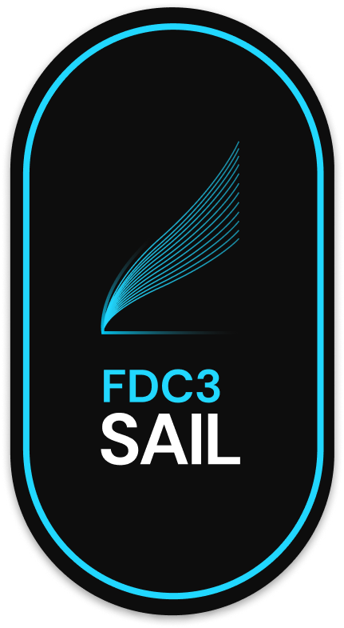

<p align="center">
    
</p>

<h1 align="center">FDC3 Sail</h3>

<h3 align="center">Develop easier. &nbsp; Build faster. &nbsp; Integrate quicker.</h3>

<br />

<p align="center">
    <a href="https://finosfoundation.atlassian.net/wiki/display/FINOS/Incubating"></a>
    <a href="https://bestpractices.coreinfrastructure.org/projects/6303"></a>
    <a href="https://github.com/finos/fdc3-sail/blob/main/LICENSE"></a>
</p>

## What is FDC3 Sail?

If you are new to FDC3, it may be helpful to check out [The FDC3 Website](https://fdc3.finos.org)

This project provides a fully open source implementation of the [FDC3](https://fdc3.finos.com) interoperability standard. Including:

- A fully featured and browser-based desktop agent featuring:
  - intent resolution
  - channel linking
  - directory search
  - workspace tabs

## Sail v2 at OSFF!

Sail v2 is a ground-up reimplementation of the FDC3-Sail project. It is a browser-based desktop agent that allows users to run and manage FDC3 apps in browser tabs or iframes. Sail v2 is built using React and makes use of [FDC3 On The Web](https://github.com/finos/FDC3/issues?q=is%3Aissue+is%3Aopen+label%3A%22FDC3+for+Web+Browsers%22) a forthcoming addition to the FDC3 standard.

FDC3 For the Web and Sail v2 will be featured at FINOS' [OSFF New York event](https://osffny2024.sched.com) in September 2024.

### Design Decisions

1.  We should support multiple app directories.
2.  Each user channel will be a HTML tab within the main browser tab.
3.  User can name and colour the user channels, and move apps between them.
4.  This is the ONLY way to control the user channel (unless the app loads outside of the main browser tab)
5.  Message passing will happen server-side as opposed to client side as in the demo.
6.  React will be used.
7.  User state will be held in a cookie, so there's no session persistence.

## Sail v1 at OSFF!

Nick Kolba (Connectifi) and Seb M'Barek (Norman and Sons) presented FDC3-Sail at the Open Source In Finance Forum (OSFF) in New York in December 2022. They showed how you could git-clone FDC3-Sail, run it and play with all the apps in the FINOS App Directory. They also showed how to build apps and share context data.

If you haven't already, check out their demo here: https://youtu.be/5VJzftderO0

At the time, Sail was an Electron App.

### The Sail v1 Implementation

- FDC3-Sail v1 is an Electron application built from the [Vite Electron Builder Boilerplate]
- The UI for the desktop agent is built using React MUI.
- All remotely hosted content is run in BrowserView following electron security best practices.

The following libraries are used:

- [Electron] cross-platform desktop framework
- [electron-builder] for packaging, distribution and auto-updates
- [Vite] for building, running and hot-reloading
- [React] for UI rendering
- [Vitest] and [React Testing Library] for testing
- [Playwright] for test automation
- [TypeScript] for type safety
- [ESLint] for linting
- [Prettier] for code formatting
- [nano-staged] and [simple-git-hooks] for code commits

[Electron]: https://github.com/electron/electron
[electron-builder]: https://github.com/electron-userland/electron-builder
[Vite]: https://github.com/vitejs/vite/
[Vite Electron Builder Boilerplate]: https://github.com/cawa-93/vite-electron-builder
[Vitest]: https://vitest.dev/
[React]: https://reactjs.org/
[MUI]: https://github.com/mui
[React Testing Library]: https://testing-library.com/docs/react-testing-library/intro/
[Typescript]: https://github.com/microsoft/TypeScript/
[Playwright]: https://playwright.dev
[Prettier]: https://prettier.io/
[ESLint]: https://eslint.org/
[nano-staged]: https://github.com/usmanyunusov/nano-staged
[simple-git-hooks]: https://github.com/toplenboren/simple-git-hooks

## Getting Started

```
npm install
npm run dev
```

Point browser at http://localhost:8090/static/da/index.html

## Mailing List

To join the Electron FDC3 Desktop Agent & App Directory mailing list please email [fdc3-sail+subscribe@lists.finos.org](mailto:fdc3-sail+subscribe@lists.finos.org).

## Contributing

1. Fork it (<https://github.com/finos/fdc3-sail/fork>)
2. Create your feature branch (`git checkout -b feature/fooBar`)
3. Read our [contribution guidelines](.github/CONTRIBUTING.md) and [Community Code of Conduct](https://www.finos.org/code-of-conduct)
4. Commit your changes (`git commit -am 'Add some fooBar'`)
5. Push to the branch (`git push origin feature/fooBar`)
6. Create a new Pull Request

_NOTE:_ Commits and pull requests to FINOS repositories will only be accepted from those contributors with an active, executed Individual Contributor License Agreement (ICLA) with FINOS OR who are covered under an existing and active Corporate Contribution License Agreement (CCLA) executed with FINOS. Commits from individuals not covered under an ICLA or CCLA will be flagged and blocked by the FINOS Clabot tool (or [EasyCLA](https://github.com/finos/community/blob/master/governance/Software-Projects/EasyCLA.md)). Please note that some CCLAs require individuals/employees to be explicitly named on the CCLA.

_Need an ICLA? Unsure if you are covered under an existing CCLA? Email [help@finos.org](mailto:help@finos.org)_

## License

Copyright 2022 FINOS

Distributed under the [Apache License, Version 2.0](http://www.apache.org/licenses/LICENSE-2.0).

SPDX-License-Identifier: [Apache-2.0](https://spdx.org/licenses/Apache-2.0)
