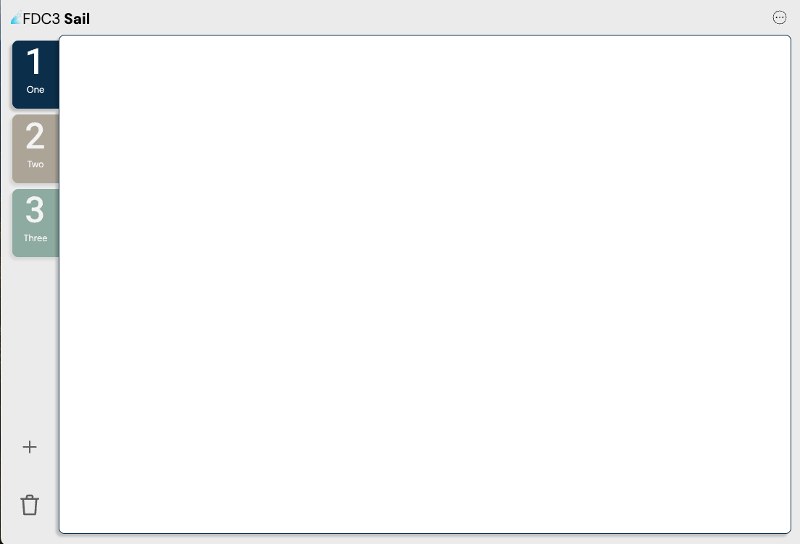
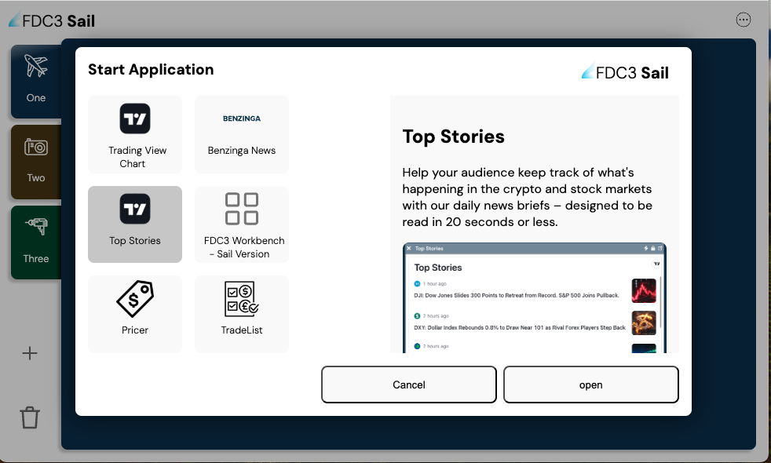
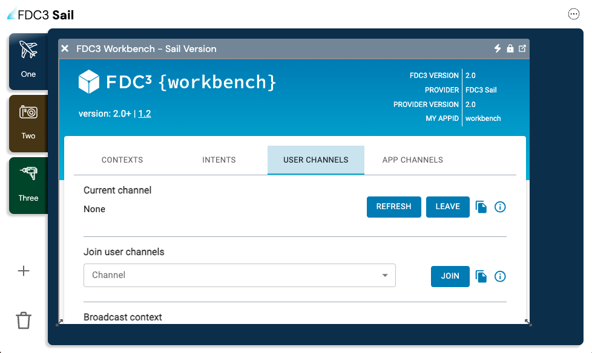

<p align="center">
    
</p>

<h1 align="center">FDC3 Sail</h1>

<h3 align="center">Develop easier. &nbsp; Build faster. &nbsp; Integrate quicker.</h3>

<br />

---

<div align="center">

[](https://finosfoundation.atlassian.net/wiki/display/FINOS/Incubating)
[](https://github.com/finos/fdc3-sail/blob/main/LICENSE)

[](https://github.com/finos/fdc3-sail)

<br />

[](https://github.com/finos/FDC3-Sail/actions/workflows/ci.yml)
[](https://bestpractices.coreinfrastructure.org/projects/12272)
[](https://scorecard.dev/viewer/?uri=github.com/finos/FDC3-Sail)
[](https://github.com/finos/FDC3-Sail/actions/workflows/semgrep.yml)
[](https://github.com/finos/FDC3-Sail/actions/workflows/ql.yml)
[](https://github.com/finos/FDC3-Sail/actions/workflows/cve-scanning.yml)

</div>

---

## What is FDC3 Sail?

If you are new to FDC3, it may be helpful to check out [The FDC3 Website](https://fdc3.finos.org)

This project provides a fully open source implementation of the [FDC3](https://fdc3.finos.com) interoperability standard. Including:

- A fully featured and browser-based desktop agent featuring:
  - intent resolution
  - channel linking
  - directory search
  - workspace tabs

## Sail v2 at OSFF!

Sail v2 is a ground-up reimplementation of the FDC3-Sail project. It is a browser-based desktop agent that allows users to run and manage FDC3 apps in browser tabs or iframes. Sail v2 is built using React and makes use of [FDC3 On The Web](https://github.com/finos/FDC3/issues?q=is%3Aissue+is%3Aopen+label%3A%22FDC3+for+Web+Browsers%22) a forthcoming addition to the FDC3 standard.

FDC3 For the Web and Sail v2 will be featured at FINOS' [OSFF New York event](https://osffny2024.sched.com) in September 2024.

## Status / Disclaimer

FDC3 Sail is based on the newly-approved FDC3 For-The-Web standard. It is currently in development and is **definitely not yet ready for production use**. Please help us advance progress by **raising issues as you find them**. Contributions welcome - see below.

### Desktop (Electron) Support

Electron support has been removed for now. Electron requires significant security hardening before it can be production-ready, so the next release will focus on FDC3 for the web. Desktop support via Electron may be revisited after Sail v3.

## Getting Started

**Note:** If you're not a developer and all of this seems very daunting - don't worry! Come along to [The FDC3 Developer Training Workshop](https://osffny2024.sched.com/event/1k1nV/fdc3-developer-training-workshop-pre-registration-required-rob-moffat-finos) anyway. Maybe you can be an extra pair of eyes and hands to help out someone else?

### Prerequisites

1.  You'll need to install `git` on your machine. Git is a version-control system and in this case will be used for downloading code from https://github.com
2.  You'll need an editor. We recommend Visual Studio Code, but you can use any editor you like.

### Checking Out the Repo

From the command line (you can open a terminal in Visual Studio Code), run the following command:

```
git clone -b sail2 https://github.com/finos/FDC3-Sail.git
```

Next, open the `FDC3-Sail` folder in Visual Studio Code.

### Running The Project (For The Browser)

From the terminal in Visual Studio Code (and assuming your current directory is now `FDC3-Sail`), run the following commands:

```
npm install
npm run build
npm start
```

Point your browser at http://localhost:8090



### Opening Apps

To open an app, click the plus icon in the bottom left corner of the sail window. You'll be given a choice of applications from the configured application directories:



Once an application is opened, you'll be able to see it, and interact with it, in the main window.



### The FDC3 Workbench

The FDC3 Workbench is a simple app that allows you to test the FDC3 API. It is hosted on the main FDC3 website at [https://fdc3.finos.org/toolbox/fdc3-workbench/](https://fdc3.finos.org/toolbox/fdc3-workbench/) and can be used within Sail by adding it via an application directory.

**NOTE:** This answers a very commonly-asked question in FDC3: Can apps be hosted on different domains? People believe this might be impossible due to browser sandboxing, but the answer is yes, and the Workbench is a good example of this.

**SECOND NOTE:** If you are running Sail on `localhost`, you will likely run into CORS issues when accessing Workbench over https. This is because workbench is running on `fdc3.finos.org`, which is secure, and trying to talk back to `localhost`, which isn't. To work around this in chrome:

- Open chrome://flags/#unsafely-treat-insecure-origin-as-secure
- Add http://localhost:8090 to the text box
- Click "Relaunch" to restart Chrome

## About Application Directories

The list of applications available to Sail is provided by Application Directory records. By default, Sail uses the [FINOS FDC3 Directory](https://directory.fdc3.finos.org/v2/apps/). You can also add your own directory URLs in Sail settings. Each directory entry describes where an application is hosted, its name, icons/screenshots, and which FDC3 messages it supports (in the `interop` section of the JSON).

## Other FDC3 Desktop Agents

FDC3 is an open standard and there are other desktop agents available. You can find a list of them on the [FDC3 Website](https://fdc3.finos.org).

## Meetings

FDC3 Sail holds regular project meetings to discuss development progress, roadmap, and community contributions.

**Join Meeting:**

- [Join FDC3 Sail Meeting](https://zoom-lfx.platform.linuxfoundation.org/meeting/95252800112?password=90638454-991c-4ab0-8aed-791fc372623c)

**Register for Meeting Series:**

- [Register for FDC3 Sail Meetings (add to calendar)](https://zoom-lfx.platform.linuxfoundation.org/meeting/95252800112?password=90638454-991c-4ab0-8aed-791fc372623c&invite=true)

Meeting agendas and minutes are tracked through GitHub issues with the `meeting` label.

## Mailing List

To join the FDC3 Sail mailing list please email [fdc3-sail+subscribe@lists.finos.org](mailto:fdc3-sail+subscribe@lists.finos.org).

## Contributing

1. Fork it (<https://github.com/finos/fdc3-sail/fork>)
2. Create your feature branch (`git checkout -b feature/fooBar`)
3. Read our [contribution guidelines](.github/CONTRIBUTING.md) and [Community Code of Conduct](https://www.finos.org/code-of-conduct)
4. Commit your changes (`git commit -am 'Add some fooBar'`)
5. Push to the branch (`git push origin feature/fooBar`)
6. Create a new Pull Request

_NOTE:_ Commits and pull requests to FINOS repositories will only be accepted from those contributors with an active, executed Individual Contributor License Agreement (ICLA) with FINOS OR who are covered under an existing and active Corporate Contribution License Agreement (CCLA) executed with FINOS. Commits from individuals not covered under an ICLA or CCLA will be flagged and blocked by the FINOS Clabot tool (or [EasyCLA](https://github.com/finos/community/blob/master/governance/Software-Projects/EasyCLA.md)). Please note that some CCLAs require individuals/employees to be explicitly named on the CCLA.

_Need an ICLA? Unsure if you are covered under an existing CCLA? Email [help@finos.org](mailto:help@finos.org)_

### Emeritus Contributors

- [Nick Kolba](@nkolba) contributed the first version of FDC3-Sail, initially called "FDC3 Electron", in 2022.
- [Seb M'Barek](@sebbenmbarek) and Nick Kolba renamed the project to FDC3-Sail and presented it at [OSFF New York in 2023](https://www.youtube.com/watch?v=dKDkOk3btWU)

### Design Decisions

1.  We should support multiple app directories.
2.  Each user channel will be a HTML tab within the main browser tab.
3.  User can name and colour the user channels, and move apps between them.
4.  This is the ONLY way to control the user channel (unless the app loads outside of the main browser tab)
5.  Message passing will happen server-side as opposed to client side as in the demo.
6.  React will be used.
7.  User state will be held in a cookie, so there's no session persistence.

## License

Copyright 2022 FINOS

Distributed under the [Apache License, Version 2.0](http://www.apache.org/licenses/LICENSE-2.0).

SPDX-License-Identifier: [Apache-2.0](https://spdx.org/licenses/Apache-2.0)
