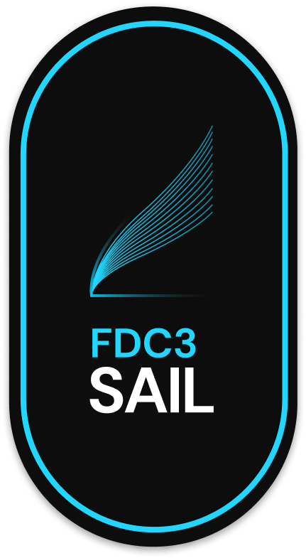

<p align="center">
    
</p>

<h1 align="center">FDC3 Sail</h1>

<h3 align="center">Develop easier. &nbsp; Build faster. &nbsp; Integrate quicker.</h3>

<br />

<div align="center">

[](https://finosfoundation.atlassian.net/wiki/display/FINOS/Incubating)
[](https://github.com/finos/fdc3-sail/blob/main/LICENSE)

[](https://github.com/finos/fdc3-sail)

<br />

[](https://github.com/finos/FDC3-Sail/actions/workflows/ci.yml)
[](https://bestpractices.coreinfrastructure.org/projects/12272)
[](https://scorecard.dev/viewer/?uri=github.com/finos/FDC3-Sail)
[](https://github.com/finos/FDC3-Sail/actions/workflows/semgrep.yml)
[](https://github.com/finos/FDC3-Sail/actions/workflows/ql.yml)
[](https://github.com/finos/FDC3-Sail/actions/workflows/cve-scanning.yml)

</div>

## What is FDC3 Sail?

If you are new to FDC3, start with the [FDC3 website](https://fdc3.finos.org).

FDC3 Sail is an open source implementation of the [FDC3](https://fdc3.finos.org) interoperability standard: a browser-first FDC3 2.2 **Desktop Agent** (`@finos/sail-desktop-agent`) that other packages compose into a broader **interoperability platform** (`@finos/sail-platform`) and two example shells. For how the pieces fit together — package ownership, entry points, and what's implemented vs. planned — see the [Architecture Overview](https://finos.github.io/FDC3-Sail/docs/architecture/overview) on the documentation site; this README does not repeat it.

### Packages and apps

| Package | Description |
|---|---|
| [`packages/sail-desktop-agent`](packages/sail-desktop-agent/) | Browser-first FDC3 2.2 Desktop Agent |
| [`packages/sail-platform`](packages/sail-platform/) | Composition layer — host UI seams, pluggable storage, lifecycle |
| [`packages/sail-theme`](packages/sail-theme/) | Shared brand theme — design tokens and assets |
| [`packages/sail-finance`](packages/sail-finance/) | Example shell — finance-specific workspace dashboard |
| [`packages/sail-one`](packages/sail-one/) | Example shell — domain-neutral tab-and-grid canvas |

Full documentation, including per-package guides, lives at **[https://finos.github.io/FDC3-Sail/docs/](https://finos.github.io/FDC3-Sail/docs/)** (built from [`website/`](website/) via GitHub Pages).

## Prerequisites

- **Node.js** >= 24.x
- **npm** >= 11.x

## Quick Start

### Clone the Repository

```bash
git clone https://github.com/finos/FDC3-Sail.git
cd FDC3-Sail
npm install
```

### Running the Browser App

```bash
npm run dev
```

Open http://localhost:3000 in your browser. FDC3 apps loaded in iframes will connect automatically via WCP. (To run the `sail-one` shell instead, use `npm run dev:one` — see the [Development Guide](https://finos.github.io/FDC3-Sail/docs/development) for details and every other command.)

## Development

This repository is documented on the site, not in this README: environment setup, the full command reference (build, test, lint, typecheck), code quality gates, and the npm publishing process all live in the [Development Guide](https://finos.github.io/FDC3-Sail/docs/development).

## Meetings

FDC3 Sail holds regular project meetings to discuss development progress, roadmap, and community contributions.

- [Join FDC3 Sail Meeting](https://zoom-lfx.platform.linuxfoundation.org/meeting/95252800112?password=90638454-991c-4ab0-8aed-791fc372623c)
- [Register for the meeting series (calendar invite)](https://zoom-lfx.platform.linuxfoundation.org/meeting/95252800112?password=90638454-991c-4ab0-8aed-791fc372623c&invite=true)

Meeting agendas and minutes are tracked through GitHub issues with the `meeting` label.

## Status

FDC3 Sail targets full [FDC3 2.2](https://fdc3.finos.org/docs/api/spec) conformance. It is currently in active development and **not yet ready for production use**. Contributions and bug reports are welcome.

## Mailing List

To join the FDC3 Sail mailing list please email [fdc3-sail+subscribe@lists.finos.org](mailto:fdc3-sail+subscribe@lists.finos.org).

## Other FDC3 desktop agents

FDC3 is an open standard; other desktop agents are listed on the [FDC3 website](https://fdc3.finos.org). Sail is one open-source implementation — you can use another agent with the same FDC3 apps where supported.

## Contributing

1. Fork it (<https://github.com/finos/fdc3-sail/fork>)
2. Create your feature branch (`git checkout -b feature/fooBar`)
3. Read our [contribution guidelines](CONTRIBUTING.md) and [Community Code of Conduct](https://www.finos.org/code-of-conduct)
4. Commit your changes (`git commit -am 'Add some fooBar'`)
5. Push to the branch (`git push origin feature/fooBar`)
6. Create a new Pull Request

See the [Development Guide](https://finos.github.io/FDC3-Sail/docs/development) for environment setup and the commands to run before opening a PR.

_NOTE:_ Commits and pull requests to FINOS repositories will only be accepted from those contributors with an active, executed Individual Contributor License Agreement (ICLA) with FINOS OR who are covered under an existing and active Corporate Contribution License Agreement (CCLA) executed with FINOS. Commits from individuals not covered under an ICLA or CCLA will be flagged and blocked by the FINOS Clabot tool (or [EasyCLA](https://github.com/finos/community/blob/master/governance/Software-Projects/EasyCLA.md)). Please note that some CCLAs require individuals/employees to be explicitly named on the CCLA.

_Need an ICLA? Unsure if you are covered under an existing CCLA? Email [help@finos.org](mailto:help@finos.org)_

### Emeritus contributors

- [Nick Kolba](https://github.com/nkolba) contributed the first version of FDC3-Sail, initially called "FDC3 Electron", in 2022.
- [Seb M'Barek](https://github.com/sebbenmbarek) and Nick Kolba renamed the project to FDC3-Sail and presented it at [OSFF New York in 2023](https://www.youtube.com/watch?v=dKDkOk3btWU).

## License

Copyright 2022–2026 [FINOS](https://www.finos.org/)

Distributed under the [Apache License, Version 2.0](http://www.apache.org/licenses/LICENSE-2.0).

SPDX-License-Identifier: [Apache-2.0](https://spdx.org/licenses/Apache-2.0)
