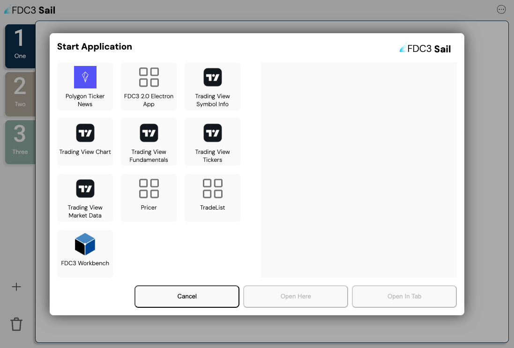
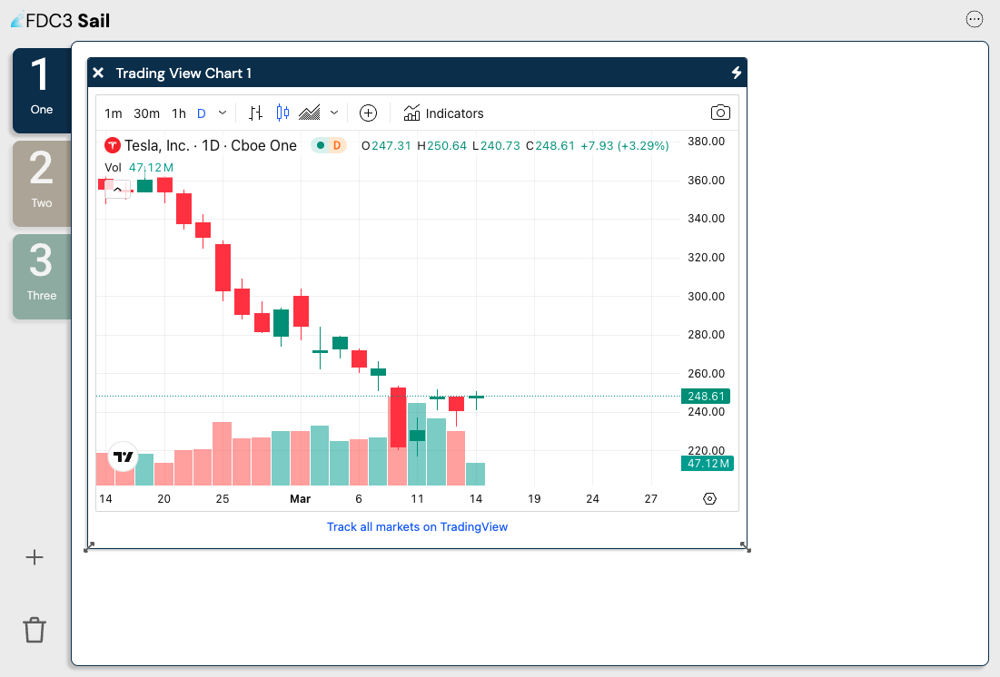

<p align="center">
    
</p>

<h1 align="center">FDC3 Sail</h3>

<h3 align="center">Develop easier. &nbsp; Build faster. &nbsp; Integrate quicker.</h3>

<br />

<p align="center">
    <a href="https://finosfoundation.atlassian.net/wiki/display/FINOS/Incubating"></a>
    <a href="https://bestpractices.coreinfrastructure.org/projects/6303"></a>
    <a href="https://github.com/finos/fdc3-sail/blob/main/LICENSE"></a>
</p>

## What is FDC3 Sail?

If you are new to FDC3, it may be helpful to check out [The FDC3 Website](https://fdc3.finos.org)

This project provides a fully open source implementation of the [FDC3](https://fdc3.finos.com) interoperability standard. Including:

- A fully featured and browser-based desktop agent featuring:
  - intent resolution
  - channel linking
  - directory search
  - workspace tabs

## Sail v2 at OSFF!

Sail v2 is a ground-up reimplementation of the FDC3-Sail project. It is a browser-based desktop agent that allows users to run and manage FDC3 apps in browser tabs or iframes. Sail v2 is built using React and makes use of [FDC3 On The Web](https://github.com/finos/FDC3/issues?q=is%3Aissue+is%3Aopen+label%3A%22FDC3+for+Web+Browsers%22) a forthcoming addition to the FDC3 standard.

FDC3 For the Web and Sail v2 will be featured at FINOS' [OSFF New York event](https://osffny2024.sched.com) in September 2024.

## Status / Disclaimer

FDC3 Sail is based on the newly-approved FDC3 For-The-Web standard. It is currently in development and is **definitely not yet ready for production use**. Please help us advance progress by **raising issues as you find them**. Contributions welcome - see below.

## Getting Started

**Note:** If you're not a developer and all of this seems very daunting - don't worry! Come along to [The FDC3 Developer Training Workshop](https://osffny2024.sched.com/event/1k1nV/fdc3-developer-training-workshop-pre-registration-required-rob-moffat-finos) anyway. Maybe you can be an extra pair of eyes and hands to help out someone else?

### Prerequisites

1.  You'll need to install `git` on your machine. Git is a version-control system and in this case will be used for downloading code from https://github.com
2.  You'll need an editor. We recommend Visual Studio Code, but you can use any editor you like.

### Checking Out the Repo

From the command line (you can open a terminal in Visual Studio Code), run the following command:

```
git clone -b sail2 https://github.com/finos/FDC3-Sail.git
```

Next, open the `FDC3-Sail` folder in Visual Studio Code.

### Running The Project (For The Browser)

From the terminal in Visual Studio Code (and assuming your current directory is now `FDC3-Sail`), run the following commands:

```
npm install
npm run web
```

Point your browser at http://localhost:8090


### Running The Project (For Electron)

From the terminal in Visual Studio Code (and assuming your current directory is now `FDC3-Sail`), run the following commands:

```bash
npm install
npm run electron
```

The desktop app should load and you should see the same screen as above.

### Opening Apps

This tutorial version of Sail contains several apps that you can open. To open an app, click the plus icon in the bottom left corner of the sail window. You'll be given a choice of applications to open like so:



Once an application is opened, you'll be able to see it, and interact with it, in the main window.



### The FDC3 Workbench

The FDC3 Workbench is a simple app that allows you to test the FDC3 API. It is bundled on the main FDC3 website at [https://fdc3.finos.org/toolbox/fdc3-workbench/](https://fdc3.finos.org/toolbox/fdc3-workbench/) and can be used within Sail. It's directory entry is in the `directory/workbench.json` file.

**NOTE:** This answers a very commonly-asked question in FDC3: Can apps be hosted on different domains? Poeple believe this might be impossible due to browser sandboxing, but the answer is yes, and the Workbench is a good example of this.

### Trading View Applications

[TradingView](tradingview.com) provides a number of widgets that can be embedded in a web page. The `packages/web/public/example-apps/tradingview` directory contains a number of apps that use the TradingView widgets and respond to FDC3 broadcast and raise intent events. The AppD records for these are in the `directory/tradingview.json` file.

### Polygon Applications

The `packages/web/public/example-apps/polygon` directory contains a number of apps that use the [Polygon API](polygon.io) you can open. The AppD records for these are in the `directory/polygon.json` file.

If you want to see the Polygon apps in action, you need to set the `POLYGON_API_KEY` environment variable to your Polygon API key.

```
POLYGON_API_KEY=your_api_key
npm run web
```

## Training / Tutorial Applications

For the purposes of the training tutorial, Sail has been bundled with two toy applications:

- `Pricer`: A simple application that displays a price for a given instrument.
- `TradeList`: A simple application that displays a list of trades.
- `ChanelListener`: A simple application that listens for messages on a channel.
- `ChannelBroadcaster`: A simple application that broadcasts messages on a channel.

You can start these from the app picker.

These applications are hed in the `directories/training.json` app directory file within the Sail distribution that you downloaded and are run from within the Sail web server. You can access them directly by visiting http://localhost:8090/example-apps/training/pricer/index.html or http://localhost:8099/example-apps/training/tradelist/index.html.

## About Application Directories

The list of applications available to Sail is provided in what's called an "Application Directory Record". You can find the Application Directory Records for the tutorial applications in the `directory/training-appd.v2.json` file. This includes details about where the application is run from (e.g. http://localhost:5000/static/pricer/index.html), what it's called, images, icons and what FDC3 messages it responds to (in a section of the json called `interop:`).

## Other FDC3 Desktop Agents

FDC3 is an open standard and there are other desktop agents available. You can find a list of them on the [FDC3 Website](https://fdc3.finos.org). Sail is just a 'toy' desktop agent, but if you would rather follow the tutorial using a different desktop agent, you can do so. Here are some instructions provided by other vendors to get started with their desktop agents.

- [Connectifi](training/instructions/Connectifi.md)
- [io.Connect](training/instructions/Io.Connect.md)
- [OpenFin](training/instructions/OpenFin.md)

## Mailing List

To join the Electron FDC3 Desktop Agent & App Directory mailing list please email [fdc3-sail+subscribe@lists.finos.org](mailto:fdc3-sail+subscribe@lists.finos.org).

## Contributing

1. Fork it (<https://github.com/finos/fdc3-sail/fork>)
2. Create your feature branch (`git checkout -b feature/fooBar`)
3. Read our [contribution guidelines](.github/CONTRIBUTING.md) and [Community Code of Conduct](https://www.finos.org/code-of-conduct)
4. Commit your changes (`git commit -am 'Add some fooBar'`)
5. Push to the branch (`git push origin feature/fooBar`)
6. Create a new Pull Request

_NOTE:_ Commits and pull requests to FINOS repositories will only be accepted from those contributors with an active, executed Individual Contributor License Agreement (ICLA) with FINOS OR who are covered under an existing and active Corporate Contribution License Agreement (CCLA) executed with FINOS. Commits from individuals not covered under an ICLA or CCLA will be flagged and blocked by the FINOS Clabot tool (or [EasyCLA](https://github.com/finos/community/blob/master/governance/Software-Projects/EasyCLA.md)). Please note that some CCLAs require individuals/employees to be explicitly named on the CCLA.

_Need an ICLA? Unsure if you are covered under an existing CCLA? Email [help@finos.org](mailto:help@finos.org)_

### Design Decisions

1.  We should support multiple app directories.
2.  Each user channel will be a HTML tab within the main browser tab.
3.  User can name and colour the user channels, and move apps between them.
4.  This is the ONLY way to control the user channel (unless the app loads outside of the main browser tab)
5.  Message passing will happen server-side as opposed to client side as in the demo.
6.  React will be used.
7.  User state will be held in a cookie, so there's no session persistence.

## License

Copyright 2022 FINOS

Distributed under the [Apache License, Version 2.0](http://www.apache.org/licenses/LICENSE-2.0).

SPDX-License-Identifier: [Apache-2.0](https://spdx.org/licenses/Apache-2.0)
