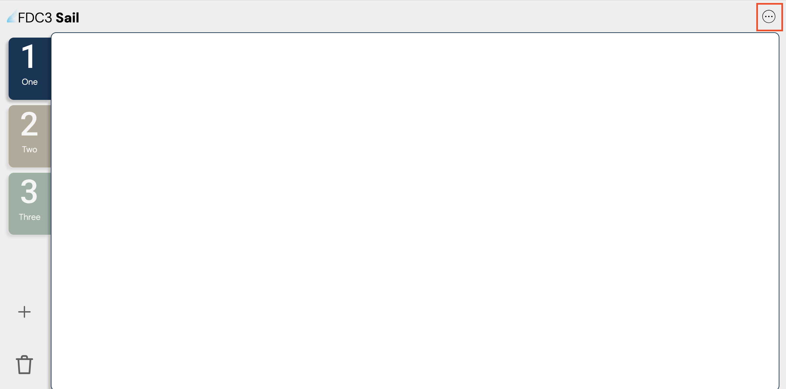
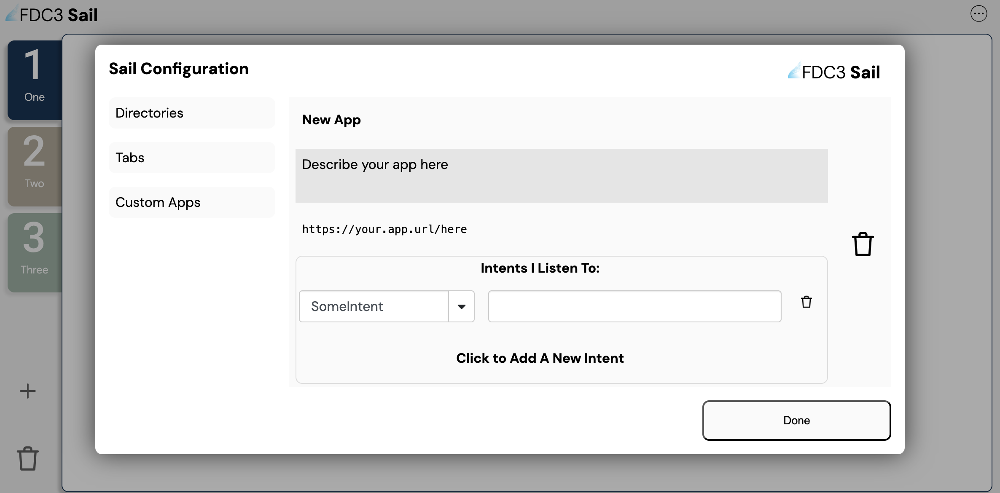
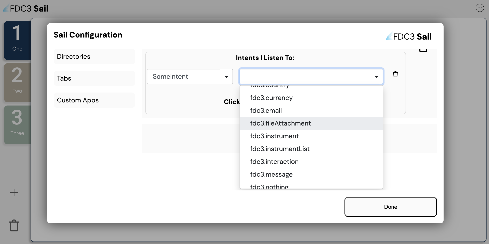

# **FDC3-Sail: FAQ**

### **What is Sail and how does it relate to FDC3?**

Sail is a free, web-based, live demonstration tool, where people are able to test out the FDC3 application interoperability. FDC3 is the standard, Sail is the digital playground. 

Sail lets anyone test drive apps inside a browser without having to download heavy software. This is especially useful for:
- Organizations where installing new software is difficult.
- People wanting to carry out a low-stakes evaluation of Sail, wanting to try it out and play around with its features.
- It is useful for many developers who need a free reference implementation. 

### **What is FDC3 for exactly?**

FDC3 is designed to stop users having to manually copy and paste data between different programs in order to view information. It provides a universal language so that software which was previously blind to other apps, can now instantly share data and trigger actions across each other automatically. To learn more about FDC3, see:
- [What is FDC3?](https://interop.io/fdc3/)
- [FDC3 overview slideshow](https://docs.google.com/presentation/d/1yvttxu1y1ffiEmmaJtDRe_5sY2soCR-Tk7UAXQbbpoE/edit?slide=id.p#slide=id.p)

### **What is a desktop agent?**

A desktop agent acts as a central 'traffic controller' running on your computer. Since individual applications are blind to each other, the agent sits in the middle, listening for data from App A and securely routing it to App B. Desktop agents do this using intents. An intent is like a request for an action to be performed. The desktop agent will catch these intents coming from the applications, and pass that data onto the other application in order for it to get done. 

### **What is FINOS and the Linux Foundation?**

- The Linux Foundation is the world's largest non-profit group, helping industries and organizations to build free to use, open technology together. [Linux Foundation Website](https://www.linuxfoundation.org/about?_gl=1*1wh6qbm*_up*MQ..*_ga*MjAxODc1NTA1NS4xNzg0MTA5NzA4*_ga_BKD8K5CRV0*czE3ODQxMDk3MDYkbzEkZzAkdDE3ODQxMDk3MDYkajYwJGwwJGgw*_ga_FBYHX832ZD*czE3ODQxMDk3MDYkbzEkZzAkdDE3ODQxMDk3MDYkajYwJGwwJGgw)
- FINOS (the Fintech open source Foundation) is the financial branch of the Linux Foundation. They manage and protect the FDC3 standard. [FINOS Website](https://www.finos.org/about-us)

### **How can beginners easily start to use FDC3 without prior knowledge about programming?**

Beginners do not need to code to use FDC3. It is normally built into many modern financial programs. As a user, all you need to do is to click applications and channels to link applications together. For example, click a stock ticker in the news app and watch as your other windows update automatically.

### **How can FDC3 benefit user experience?**

FDC3 makes working financially on a computer smooth and fast by doing the following:

- Removing double-typing, all you need to do is click once to update all of your apps.
- Reduces screen clutter, never again will you need to hunt through dozens of overlapping windows.
- Prevents mistakes by removing the chance for human error by copy and pasting the wrong numbers.

### **What will happen to my applications if I go offline?**

1. In FDC3, since it does not rely on a cloud connection to pass messages, the desktop agent will run locally right on your computer. This means that open applications will continue to talk to each other and pass data continuously even if your internet drops out.
2. In Sail, it will continue to function. This is due to Sail running locally on your browser hence, applications do not need a cloud connection to talk to each other. You will still be able to test workflows and pass data between apps while Sail is offline. 

### **If one of my apps crashes, how would this affect my other apps?**

A single app crash would not affect/break your setup. This is due to FDC3 applications being loosely connected independent programs. E.g. if your charting app crashes, your news feed, chat window and other trading platforms will be able to continue to talk to each other completely unaffected.

### **How does FDC3 protect my financial data?**

Applications cannot spy on your desktop or grab data from other platforms freely, as these applications have no direct relationship with their counterparts. This is because FDC3 relies on browser sandboxing, which means that it places all individual applications into their own isolated digital cells. This is done through applications communicating through the desktop agent, which verifies the identity of the applications that they connect. 
- See more on [FDC3 Website - Security & Identity](https://fdc3.finos.org/docs/next/api/security)

### **What devices can FDC3 be used on?**

FDC3 can be used on almost any standard office computer. It is built to be platform agnostic, meaning that it runs seamlessly across many operating systems.
Sail can be run on any device that is able to run a browser.

### **How does Sail act as a 'sandbox'?**

Sail will run directly inside any ordinary browser. It creates an isolated, 'digital playground'. In this space developers and designers can drop in their new financial applications to see if they are able to follow the FDC3 rules correctly, basically seeing if their app is able to talk to other apps directly. It mimics a complex trader desktop without the need to install heavy, high-security corporate systems onto your device.

### **Why is it important to use Sail to test workflows?**

**- Catching silent but harmful bugs:** Financial workflows often will fail due to App A sending a message that App B cannot understand. Sail can be used to test this and catch these language barriers before they are implemented.

**- Saving tech teams time:** Testing software on a banking network is slow and frustrating. However, using Sail to test in a sandbox takes mere minutes, speeding up the process of these tools being built.

**- Verifying connectivity:** Using sail to test workflows is essential as it is able to ensure secure connections between applications, and verify its core functions such as launching apps, sharing data and raising intents.

### **How can I add new applications into Sail?**
Opening your application into Sail is easy once you are able to host it as a html web page. Once you have done this, follow these easy steps:
1. Open Sail within your browser and locate the three dots button which will take you to the Sail Configuration menu. 

2. Within this menu, select 'Custom Apps' and click add new app.

3. From here you are able to paste the URL of your local or hosted web app, give it a name and select what intents it listens to by using the drop-down button as shown here:

From there just select done and your app should be able to be opened in Sail. 
Well done! You have just injected your web app into Sail without changing any code files.

### **What do I need to do in order to create my own app which is compatible with FDC3?**

You are able to turn any basic financial web page into an FDC3 app by following these steps:
1. Web apps cannot talk to each other directly through FDC3 without a host framework. Your app must be run inside an enterprise container or a browser extension.
2. Create your app definition by describing it so that the desktop agent knows how to launch it, and what data it supports. Use a configuration file in JSON to host this.
3. The web app needs to be actively listening for incoming data or intents from the rest of the desktop. You can do this by adding the code to handle data using JS.
4. Test your app using FDC3-Sail. To do this you will need to serve your application locally. Then configure your App Definition JSON, drop it into Sail's local directory, and use Sail's built-in [FDC3 Workbench](https://github.com/finos/FDC3/blob/main/toolbox/fdc3-workbench/README.md) to mock and monitor interactions.
 
   **This is a simplified explanation, so see these links for further understanding:**
- Learn through the online course, [How to develop with FDC3](https://training.linuxfoundation.org/training/developing-solutions-with-fdc3-lfd237/)
- Also see [toolbox package holding sample web applications](https://github.com/finos/FDC3/tree/main/toolbox/fdc3-example-apps)
- Don't forget, [Using the FDC3 Workbench](https://finsemble.interop.io/docs/connect-apps/interop/FDC3Workbench/) which provides more in-depth examples and more advanced intel on the code. 
