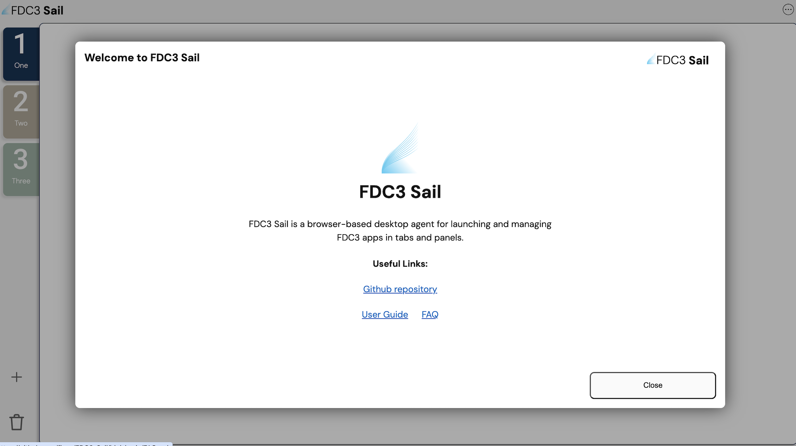
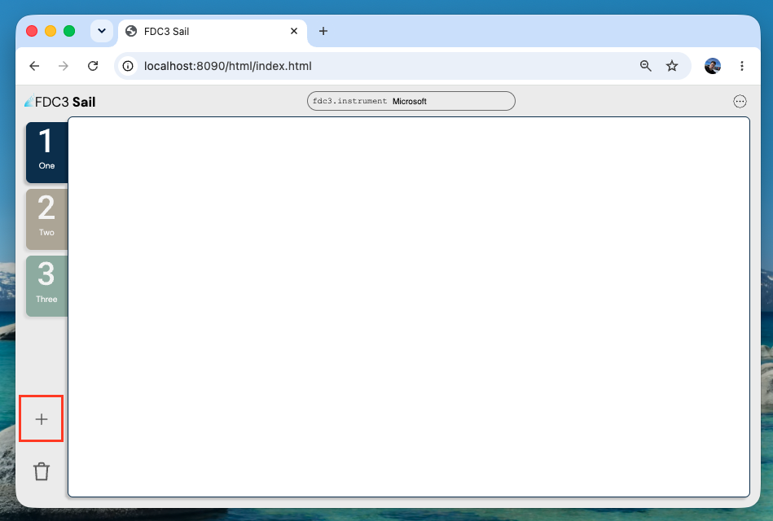
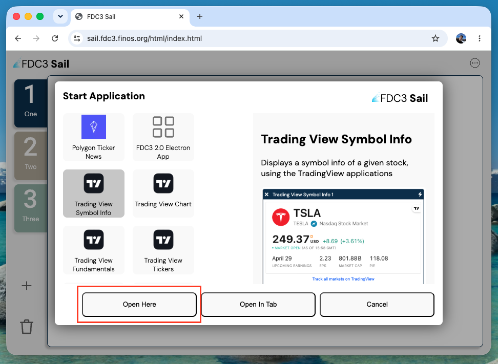
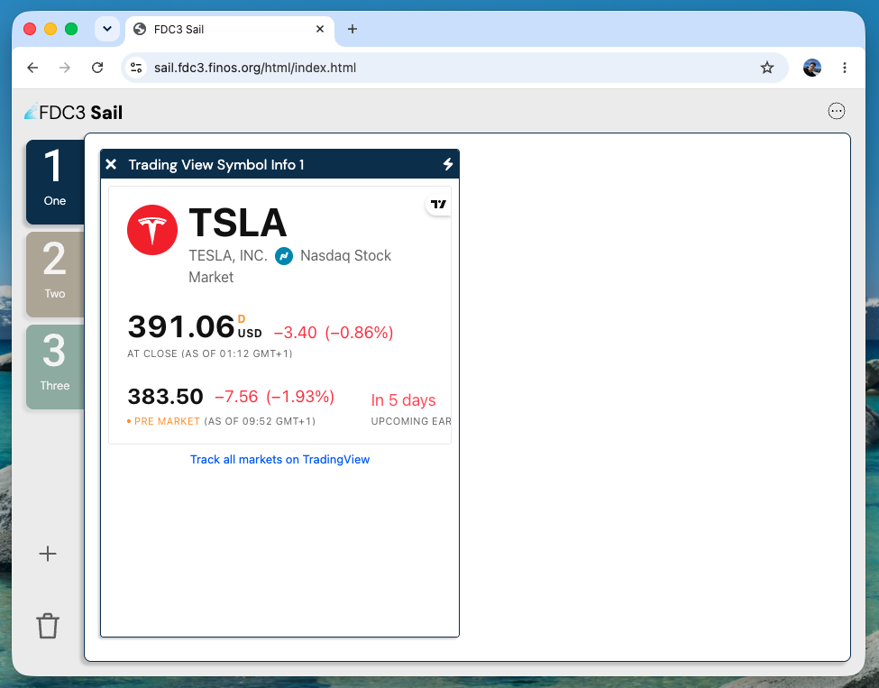

# **Welcome to the FDC3-Sail Guide!**

## **What is Sail and what is FDC3?**

**Firstly, prerequisites**

1. If you are developing with Sail, you will need to understand and install Git, VS code, node.js, and hosted web pages to get started.
2. You will also need a good grasp on what FDC3 is/does and how it helps users.

   **You can view this here:**

### **FDC3:**

FDC3 is essentially a universal translator rulebook for this financial software. Instead of being a tangible piece of software, it is a set of open rules that tech companies all agree to follow. When apps follow these rules, they will be able to communicate with one another, instead of being practically blind to each other.

This relies on two main concepts,

**-Context sharing** **(Nouns):** If you click a company on the news app for example, it will instantly broadcast that "noun" to other apps, this means that these other apps will update to show that company's data without you having to click anything else.

**-Intents (Verbs):** This allows one app to ask another app to perform an action. E.g. a chat app can send a message to a chart app saying, "View chart for Apple", and the chart will open automatically.

### **Sail:**

Managed by our open source community, FINOS, FDC3-Sail is a free, web-based tool designed to act as a standards-compliant FDC3 desktop agent.

Setting up financial software is complex, most people want to test FDC3 out before committing to it. Sail gives people a safe environment inside the internet browser that allows users and learners to open apps, learn the basics and discover how the FDC3 standard works.

Sail helps users by:

### **1. Providing an online desktop agent**

- **No installation required** - It runs directly inside the browser.
- **Instant setup** - Users do not need to download heavy software.
- **Risk-free space** - Offers a safe environment to test tools without touching real financial systems.

### **2. Open source and white-label ready**

- **Open source implementation** - Sail is a free, FINOS-hosted reference implementation of an FDC3 desktop agent that anyone can inspect, run, and contribute to.
- **White-label for firms** - Banks and vendors can fork Sail and customize branding, configuration, and hosting to create their own desktop-agent experience on top of a standards-compliant core.
- **Avoid starting from scratch** - Teams get a working FDC3 agent as a foundation, then adapt it to internal requirements instead of building interoperability infrastructure alone.

### **3. Helps teams build better tools**

- **Speeds up development** - Software creators can use Sail to test their apps quickly.
- **Saves time** - Teams can prototype their ideas in minutes.
- **Ensures compatibility** - Helps these builders verify that their software follows FDC3's rulebook correctly.

Now that you know what FDC3 and Sail does and how it works, here are some instructions on how to get started using FDC3-Sail:

## **🛠️ How to Use Sail (Step-by-Step)**

You can use Sail two ways:

1. Using (https://sail.fdc3.finos.org/html/index.html) - This is the browser version. Can be used to easily test workflows and can be opened on any browser.
2. Installing Sail locally - README.md [here](https://github.com/finos/FDC3) explains in detail how to install Sail locally.

- When opening Sail for the first time or by clicking Sail logo, you will be met with this menu which depicts a short description and links for more information on Sail:
  

### Starting Your First Application

Once you have the Sail app loaded in the browser, hit the plus button on the bottom left of the screen to open the directory picker.

Choose one of the built-in applications from the list and click "Open Here"

The application will load into the current workspace (One) in a resizable window like this:

## **How being open source benefits FDC3-Sail**

#### **Completely free and open source:**

- Anyone from a student to a major bank can use it without paying expensive licensing fees.
- Companies can adopt it instantly without waiting for corporate financial approval.
- Uses the Apache 2.0 licence. This gives people total freedom to download, modify and even sell products that are built using/on Sail. The only catch is that you must give credit to the original creators.

#### **Anyone/Everyone can help fix and improve**

- Instead of just one small company building it, many programmers worldwide contribute updates.
- Neutrally governed by FINOS.
- If a bug or glitch pops up, someone in the global community usually spots it and can fix it immediately.
- The community can keep the tool alive and updated constantly.

#### **Builds trust and security**

- Because the code is public to everyone, companies can verify that Sail is not secretly stealing data or containing possible malware.
- With Sail being open source, this builds trust and a community. This makes it a neutral, highly trusted platform which encourages collaboration.

## **Summary: The future of Wealth Tech**

Ultimately, FDC3 and Sail both solve the single biggest annoyance on financial desktops: The software isolation.

FDC3 acts as the universal language rulebook for these types of software, allowing different apps to communicate seamlessly. While Sail serves as the interactive playground, letting teams simulate, test and witness what FDC3's communication would be like without the complex steps.

Many have already used the FDC3 standard, in over 100 organizations across the financial system. These major organizations use FDC3 and Sail to streamline their workflows, and safely prototype their tools.
