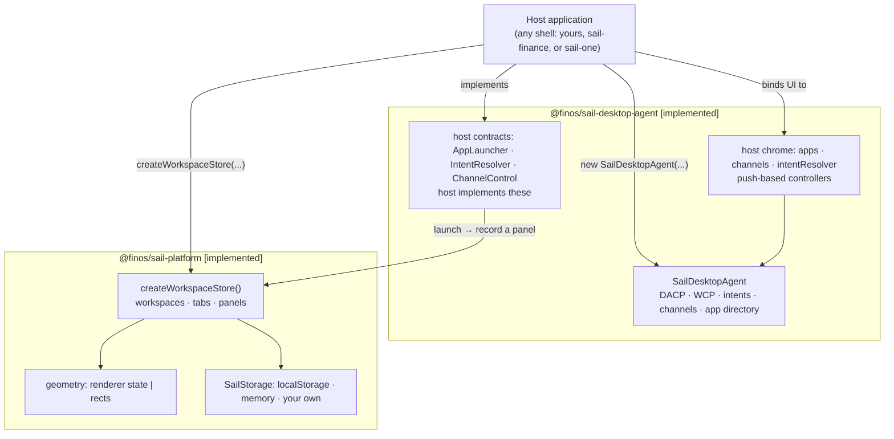
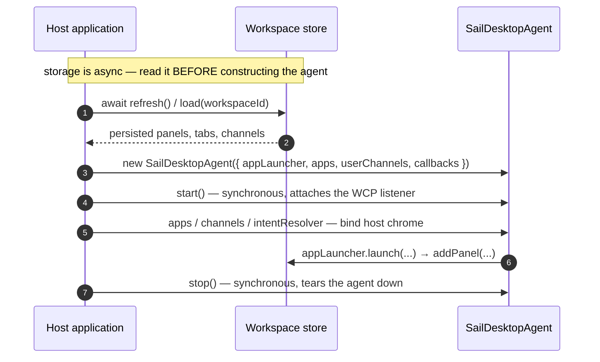

# Architecture Overview

This page is the single source of truth in these docs for how the FDC3 Sail packages compose: who
owns what, the two supported entry points, the host-contract surface, and how an app connects. Every
other page links here instead of redrawing the stack.

## Status markers

Every architectural claim on this page (and, by convention, elsewhere in these docs) carries one of
two markers:

- **`[implemented]`** — the code does this today. You can rely on it and build against it now.
- **`[planned]`** — designed, and possibly partially scaffolded, but not usable yet. Never read a
  `planned` claim as something you can call today.

Status is read off the code, not off how many hosts in this repo happen to exercise an API. An API is
`implemented` if the package implements it, whether or not any shell here drives it.

## Core principles

### 1. FDC3 compliance first

- FDC3 apps use the standard `@finos/fdc3` library.
- App-to-agent communication follows FDC3 For-the-Web: WCP for discovery and connection, DACP for
  Desktop Agent operations.
- Sail-specific workspace, layout, config, and product-shell behavior stays outside the FDC3 engine.

### 2. Clear package ownership

- **`@finos/sail-desktop-agent`** **`[implemented]`** — the FDC3 engine. Owns `SailDesktopAgent`, DACP
  handlers, the WCP browser app connection, host contracts, and app directory logic. It does not depend
  on the platform or any shell (enforced — see [Enforced boundaries](#enforced-boundaries) below).
  `DesktopAgent` is the internal base class `SailDesktopAgent` extends; it is `@internal` and not a
  public entry point — see [Composition & internals](../packages/desktop-agent/composition#one-construction-path).
- **`@finos/sail-platform`** **`[implemented]`** — workspaces, layouts, and storage. It describes *what
  is loaded* and *how it looks*, for any host UI. It has **no dependencies** — not on the agent, not on
  FDC3, not on a UI framework — so the two packages are peers a host composes, not layers stacked on
  each other. See [How the packages compose](#how-the-packages-compose) below and
  [@finos/sail-platform](../packages/platform/overview) for the full package description.
- **Shells** — `sail-finance` and `sail-one` are **example host applications**: working, deployable UIs
  that demonstrate what the platform can be built into. They provide UI, app launch surfaces, and
  packaging, composing the stack either directly or through the platform layer. The split between them is
  **domain**, not maturity: `sail-finance` is a **finance-specific** example, `sail-one` a
  **domain-neutral** one for more general use. Treat both as starting points to deploy or adapt, not as
  the only shapes a Sail host can take.

### 3. Composition over hidden globals

Sail does not rely on a host-page `window.fdc3` preload. FDC3 apps run in iframe or window browsing
contexts and discover the Desktop Agent through WCP. Host UI talks to the `SailDesktopAgent` API
directly.

### 4. Browser-first Desktop Agent

The supported v3-pre product path is a browser-resident Desktop Agent: one `SailDesktopAgent` per host
page, with FDC3 apps connecting through WCP and per-app `MessagePort`s. Worker, server, native, and
cross-device paths are future adapters rather than current adoption paths — see
[Deployment targets](./deployment-targets).

### 5. One Desktop Agent per browsing context **`[implemented]`**

FDC3 assumes one logical Desktop Agent per user session — one channel graph, one app-instance registry,
one intent-resolution flow. `@finos/sail-desktop-agent` does not enforce this globally (tests and
advanced setups may construct more than one `DesktopAgent`), so **a browser host must enforce the
singleton itself** — one agent per top-level `window` (tab). Creating two
in the same tab yields split-brain: duplicate WCP listeners, conflicting instance registries, and
channel UI that reads the wrong agent. This is a property of the package's design, not a bug to route
around — see [Integrator guide — one Desktop Agent per context](../packages/desktop-agent/integrator-guide.md#one-desktop-agent-per-context)
for the enforcement pattern.

## How the packages compose

The two packages are **peers, not layers**. A host imports both and joins them itself; neither wraps
the other, and `@finos/sail-platform` has no dependency on `@finos/sail-desktop-agent`.

| | `@finos/sail-desktop-agent` | `@finos/sail-platform` |
|---|---|---|
| Owns | FDC3: intents, contexts, channels, app directory, DACP/WCP | workspaces, layouts, storage |
| Entry point | `new SailDesktopAgent(options)` + `.start()` | `createWorkspaceStore(options?)` |
| Dependencies | `@finos/fdc3`, `@finos/fdc3-schema` | none |
| Status | **`[implemented]`** | **`[implemented]`** |

```typescript
import { SailDesktopAgent, type AppLauncher } from "@finos/sail-desktop-agent"
import { createWorkspaceStore } from "@finos/sail-platform"

const workspaces = createWorkspaceStore()

const agent = new SailDesktopAgent({
  appLauncher, // the host's own AppLauncher — mounts panels, tabs, windows
  apps: directoryApps,
  userChannels,
  onAppConnected: metadata => markConnected(metadata.instanceId),
})
agent.start()
```

The join between them is the host's `AppLauncher`: the agent asks it to open an app, and the host's
implementation records a panel in the workspace store and mounts the container. FDC3 identity flows
one way, layout state the other, and neither package needs to know about the other's types.



### Lifecycle and its one real constraint

`new SailDesktopAgent(options)` only builds the object; `.start()` attaches the `window` listener that
lets iframe apps complete `fdc3.getAgent()`. Both `start()` and `stop()` are **synchronous**.



**The constraint worth knowing `[implemented]`:** `apps` and `userChannels` are **constructor data**,
and `start()` is **synchronous** — but storage is **asynchronous**. A host that seeds the agent from
persisted state must therefore `await` its reads *before* constructing the agent, not after starting
it. Starting first and reconciling later means the agent runs briefly on defaults and needs a restart
to correct itself. `sail-one/src/state/client-state.ts` (`await load()` before
`registerDesktopAgent`) is a worked example of following it.

## Host-contract surface

A host implements a small set of seams, all owned by `@finos/sail-desktop-agent`:

| Seam | Required? | Purpose |
|---|---|---|
| `appLauncher: AppLauncher` | **yes** | Open and close apps in the host's own windows/panels. |
| `intentResolver?: IntentResolver` | no | Render intent-resolution UI. Omitted ⇒ first handler auto-selected. |
| `channelSelector?: ChannelControl` | no | Render channel-selection UI. Omitted ⇒ apps handle it themselves. |

`AppLauncher` is a two-method contract the host implements directly — `launch(request, appMetadata)`
returning an `AppIdentifier`, and an optional `close(instanceId)` for `fdc3.close()`. The host mints
the instance id when the request does not carry one, and the id it renders with is the id WCP4 later
adopts. Both shells in this repo implement it inline (`sail-finance/src/main.tsx`,
`sail-one/src/state/sail-host.ts`); there is no wrapper class to learn.

Because Sail hosts control their own UI, the agent's injected-iframe intent resolver and channel
selector are off by default (`getIntentResolverUrl: () => false`,
`getChannelSelectorUrl: () => false`, `browser-app-connection.ts:84-88`) — the host's own
implementations are the only UI, with no configuration required.

**Host chrome `[implemented]`.** `SailDesktopAgent` exposes push-based grouped controllers for host
UI — `apps`, `channels`, `intentResolver` — including `channels.changeAppChannel(instanceId, channelId)`
and the authoritative one-off read `channels.getAppChannelId(instanceId)`. Hosts should bind to these
controllers rather than polling agent state.

## App connection model

FDC3 apps connect through WCP and then exchange DACP messages over a per-app `MessagePort`:

```text
FDC3 app iframe/window
        │  WCP discovery + MessagePort
        ▼
Browser edge connector (BrowserAppConnection)
        │  attached app connection
        ▼
SailDesktopAgent
```

For the detailed connection flow, module ownership, and manual composition patterns, see
[Composition & internals](../packages/desktop-agent/composition) and the
[Desktop Agent integrator guide](../packages/desktop-agent/integrator-guide). See
[Channel selection](./channel-selection) for the boundary between host chrome and app-hosted
selector URLs.

## Workspaces, layouts and storage `[implemented]`

`@finos/sail-platform` describes a host's own state, with no FDC3 in it. `Workspace` is *what is
loaded* — a named, saveable set of apps; `Layout` is *how it looks* — tabs, panels, and one of two
geometry lanes:

- **`{ mode: "renderer", state }`** — arrangement owned by a layout library (Dockview,
  golden-layout), opaque to the platform;
- **`{ mode: "rects" }`** — plain coordinates on each panel, for hosts placing panels themselves.

The union is deliberate: two sources of truth for the same arrangement is how saved layouts silently
diverge between hosts, so `setPanelRect` throws on a layout a renderer owns.

Persistence is a four-method `SailStorage` port (`get`/`set`/`remove`/`list`) with `localStorage` and
in-memory adapters supplied. A remote backend is an object satisfying the port, not a package change.
`list` is what lets a host render a workspace picker without loading every workspace in full.

The store is `subscribe`/`getSnapshot`-shaped, so React binds via `useSyncExternalStore` and any other
UI binds the same way. See [@finos/sail-platform](../packages/platform/overview) for the full surface.

## Extensibility: the observability seam `[planned]`

There is no middleware mechanism to document here, and no extension point inside the message path.

The customisation and telemetry mechanism is instead the **agent observability seam**: a typed
`AgentEvent` stream surfaced on the `SailDesktopAgent` controller surface — alongside logging, channels,
and intents — emitted **after** each FDC3 operation and unable to block or alter it. It has two
separable halves: event tracking, which a host maps to OpenTelemetry itself (the agent takes no OTEL
dependency); and logging, where the existing `Logger` stays plain diagnostics that a host may map to
OTEL Logs.

The seam is fully designed but **not yet built** — no `observe()` API exists to call today. This page
describes its intended shape only; it will be documented properly when it lands.

## Enforced boundaries

The layering above is not just prose — it is a CI gate. `npm run lint` also runs
`.oxlintrc.json`'s `no-restricted-imports` rules and fails the build if:

- `@finos/sail-desktop-agent` imports the platform or any shell (the engine must not depend on what
  composes it);
- `sail-finance` and `sail-one` import each other (shells share only `@finos/sail-theme` or the
  platform, never shell-to-shell).

Treat this as the executable version of the rules on this page, not a restatement of them.

## Learn more

- [Deployment targets](./deployment-targets) — browser host deployment and the future native-shell direction.
- [Channel selection](./channel-selection) — host chrome vs app-hosted channel selector flows.
- [App admission and origin trust](./security) — what the agent enforces at WCP4, and what a deployment must arrange itself.
- [@finos/sail-desktop-agent](../packages/desktop-agent/overview) — FDC3 engine, integrator guide, and composition diagrams.
- [@finos/sail-platform](../packages/platform/overview) — workspaces, layouts, and storage.
- [@finos/sail-theme](../packages/sail-theme/overview) — the shared design-token package the two shells and this site draw from.
