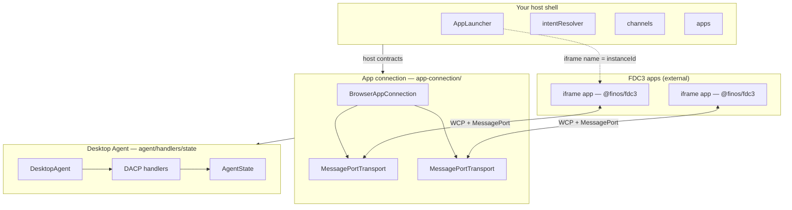
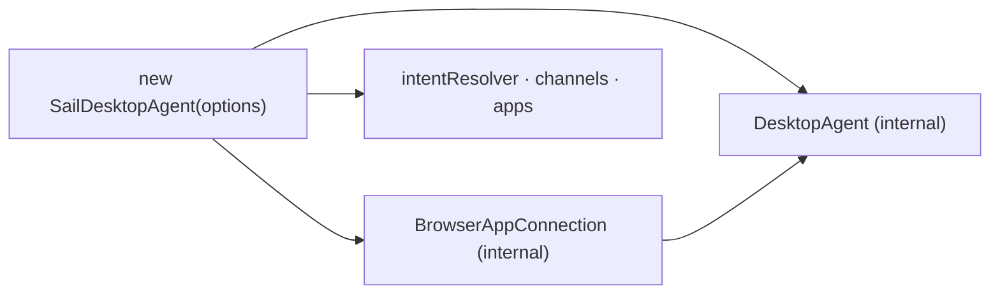
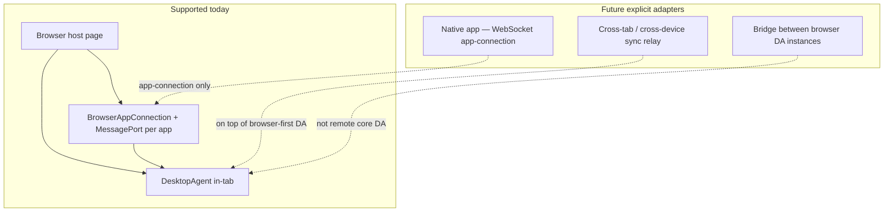
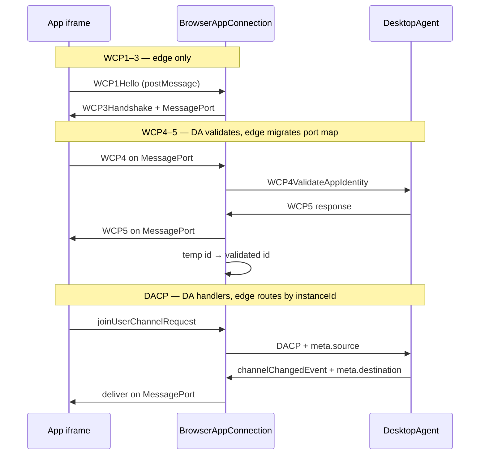
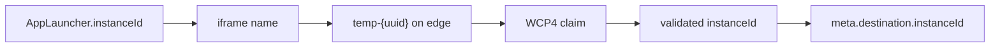
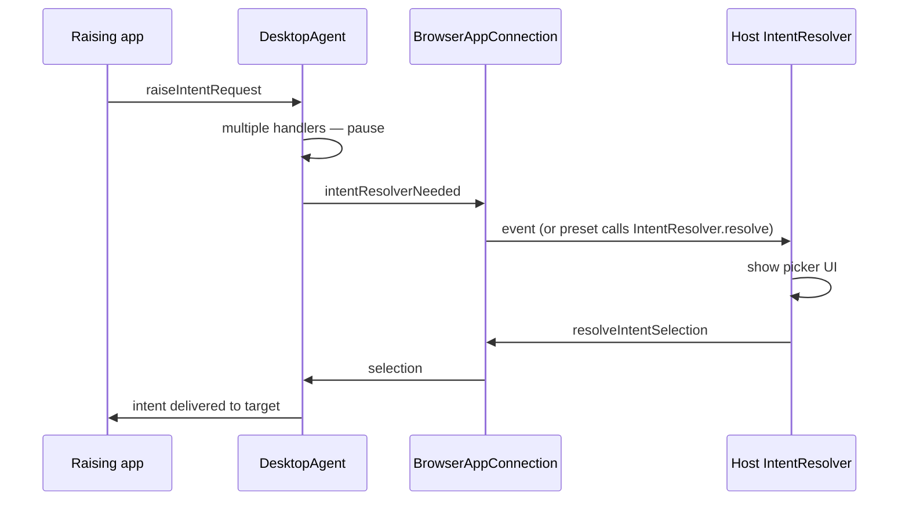
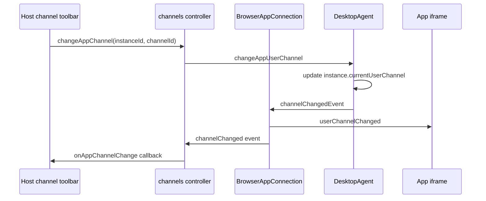

# Composition & internals

How `@finos/sail-desktop-agent` modules compose and interact. For integration steps and copy-paste examples, see the [integrator guide](./integrator-guide).

## Layered runtime model



**Key rule:** apps never talk to `DesktopAgent` directly. In browser hosts, app traffic flows **MessagePort → BrowserAppConnection → DesktopAgent → AppConnectionRegistry → MessagePort**.

## One construction path



`SailDesktopAgent` owns the browser edge, the state binding, and the lifecycle. It is not
an assembly of parts you can swap: it *extends* `DesktopAgent`, and a bare `DesktopAgent`
throws on any DACP routing until an edge is attached.

| You provide | You get |
|-------------|---------|
| `AppLauncher` — mount the iframe with `name = instanceId` | `intentResolver`, `channels`, `apps` controllers plus `start()` / `stop()` |

`AgentAppConnection` — the contract the edge implements — is deliberately not exported.
A replacement edge (WebSocket, native host) would ship as its own package implementing
that contract, at the point one is actually needed.

### Deferred deployment paths (not on v3-pre)



Remote Desktop Agent (`createWCPClient` + server-hosted engine) was removed from presets. Native desktop apps and multi-device sync are planned as **app-connection** or **sync** adapters — not as a reason to host the core DA on a remote process. See the [integrator guide — deferred paths](./integrator-guide#server-worker-native-and-multi-device-paths-deferred).

## Source tree responsibilities

```text
packages/sail-desktop-agent/src/
│
├── agent/
│   ├── desktop-agent.ts       # DesktopAgent class — start/stop, handler dispatch
│   ├── sail-desktop-agent.ts  # Browser-ready constructor + host controllers
│   └── default-config.ts
│
├── host-contracts/
│   ├── app-launcher.ts        # AppLauncher — host opens iframes/windows
│   ├── intent-resolver.ts     # IntentResolver — disambiguation UI contract
│   └── channel-control.ts     # ChannelControl — picker contract shape
│
├── app-connection/
│   ├── browser-app-connection.ts # WCP listener + MessagePort registry
│   ├── wcp/                   # WCP handshake, routing, connection map
│   └── message-port.ts
│
├── handlers/
├── state/
├── dacp/
│   └── validate-dacp-message.ts  # FDC3 schema validation — off | warn | strict
└── app-directory/
```

## WCP and DACP ownership



| Phase | Owner | Code location |
|-------|--------|---------------|
| WCP1–3 | Edge | `app-connection/browser-app-connection.ts`, `app-connection/wcp/wcp1-3-handshake.ts` |
| MessagePort bridge | Edge | `app-connection/message-port.ts`, `app-connection/wcp/wcp-message-routing.ts` |
| WCP4–5 | DA (+ edge port migration) | `app-connection/wcp/wcp-identity-validation.ts`, `handlers/open/handlers.ts` |
| WCP6 Goodbye | Both | Edge drops port; DA removes instance |
| DACP (all `fdc3.*`) | DA | `handlers/*` |

## Instance identity pipeline

Toolbox `AppTimeout` usually means a break in this chain:



| Step | Module |
|------|--------|
| Launcher returns id | `host-contracts/app-launcher.ts` |
| Open registers PENDING | `handlers/open/handlers.ts` |
| WCP4 adopt vs mint | `app-connection/wcp/wcp-identity-validation.ts` |
| Port map migration | `app-connection/wcp/wcp-connection-management.ts` |

## Intent resolution flow



Two mechanisms exist for intent UI — see [integrator guide — intent resolver](./integrator-guide#intent-resolver--host-shell-ui):

- **Host shell (default):** `intentResolver` controller or low-level `IntentResolver` contract
- **WCP3 injection:** `appConnectionOptions.intentResolverUrl` — `@finos/fdc3` loads iframe in app window

## Channel change flow (host chrome)



Browser hosts use **`channels.changeAppChannel`** and **`channels.onAppChannelChange`** — see [integrator guide](./integrator-guide#channel-selector--host-shell-ui).

`SailDesktopAgent` exposes these controllers directly.

## Testing layers

| Layer | Suite | Proves |
|-------|-------|--------|
| DACP handlers | Cucumber + MockTransport (~135 `@fdc3_2.2`) | FDC3 handler behaviour |
| Handler units | Vitest in `dacp/__tests__/` | Individual request paths |
| Edge seam | `wcp-desktop-agent.integration.test.ts` | WCP + MessagePort + DA routing |
| Full oracle | FINOS toolbox via conformance harness | End-to-end browser behaviour |

See [conformance traceability](./conformance) for BDD vs toolbox gaps.

## Related

- [Integrator guide](./integrator-guide) — host contracts, browser-first agent, WCP/DACP detail
- [Channel selection (Sail stack)](../../architecture/channel-selection) — host chrome vs app-hosted selector UI
- [@finos/sail-platform](../platform/overview) — workspaces, layouts, and storage
