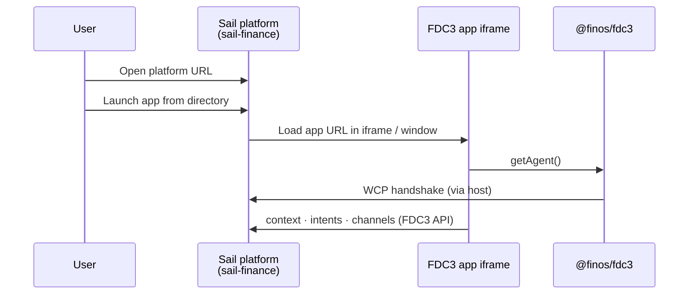

# Run Sail

Use this guide when you want to **run or host the FDC3 Sail platform** with minimal custom code — the full workspace UI, intent resolver, channel selector, and app directory wired for you.

You do **not** need to implement host contracts yourself. Configure your app directory, build or run the product, and connect FDC3 applications.

## Deployment target

| Target | Package | Best for |
|--------|---------|----------|
| **Browser / PWA** | `@finos/sail-finance` | URL or installable PWA; simplest deployment; no native installer |

`sail-finance` exposes a **Desktop Agent** to FDC3 apps. Your applications use `@finos/fdc3` and `getAgent()` — see [Add your app to Sail](./add-your-app).

For details on sandboxing, updates, and OS integration — and the future native-shell direction — see [Deployment targets](./architecture/deployment-targets).

## Prerequisites

- Node.js **24+**
- npm **11+**

```bash
nvm use 24
```

## Quick start (from source)

The `sail-finance` platform package is developed in the [FDC3-Sail monorepo](https://github.com/finos/FDC3-Sail). Clone and run:

```bash
git clone https://github.com/finos/FDC3-Sail.git
cd FDC3-Sail
npm install
```

### Browser mode

```bash
npm run dev
```

This starts the Desktop Agent, platform API, and Sail web UI. Open **http://localhost:3000**.

## App directory

FDC3 Sail loads application metadata from an **app directory** — JSON describing which apps exist, their URLs, intents, and context types.

The development build merges the FINOS conformance fixture from `packages/sail-conformance-harness/conformance-appd.json` so you can exercise standard FDC3 behaviour immediately. For your own deployment, replace or extend this with your organisation's app directory (same [FDC3 App Directory](https://fdc3.finos.org/docs/app-directory/spec) schema).

Point your deployment at the directory URL or file your build expects (see `packages/sail-finance` wiring for the current default). For app metadata examples, see [Add your app to Sail](./add-your-app#app-directory-entry).

## Build and host

Build the static web application from the monorepo root:

```bash
npm run build
```

Host the `packages/sail-finance/dist` output on HTTPS in production (FDC3 For-The-Web requires a secure context for app connections). You can deploy behind your reverse proxy, CDN, or internal web tier.

## Enterprise deployment

FDC3 Sail is under active development and not yet ready for production use (see the root [README status](https://github.com/finos/FDC3-Sail#status)). Treat the following as **your** integration work when rolling out at enterprise scale:

- **Identity and access** — SSO, entitlements, and app directory governance
- **Packaging and distribution** — PWA policy, MDM
- **Operations** — monitoring, logging, incident response, version pinning
- **Network and security** — HTTPS, origin policy, app URL allowlists

Workspace and layout state persists via `sail-finance`'s own store (Zustand + `localStorage`) — it does not go through `@finos/sail-platform`. If you are building a custom host and want platform-backed persistence instead, see [Getting Started](./getting-started) and the [platform overview](./packages/platform/overview).

## What happens at runtime



## Next steps

- [Deployment targets](./architecture/deployment-targets)
- [Add your app to Sail](./add-your-app)
- [@finos/sail-finance overview](./packages/sail-finance/overview)
- [Getting Started](./getting-started) — if you later need a custom host instead of the full platform
- [Development Guide](./development) — if you want to contribute to Sail itself
